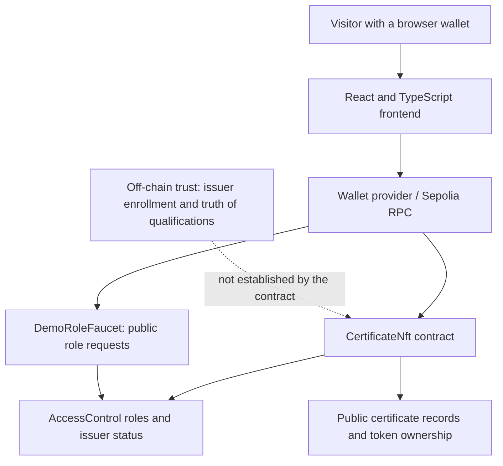

# Bound Credentials

**Issue and inspect wallet-bound certificates on Ethereum Sepolia.**

A transferable token can change owners without the underlying qualification changing. Bound Credentials explores a narrower question: **what can a non-transferable credential establish about a wallet, and what still depends on the issuer and enrollment process?**

The prototype records issuer-created certificates and rejects token transfers. It does not prove a unique person, a real qualification, or an institution's legitimacy. The public demo deliberately lets visitors request privileged roles.

## Review guide

| Resource | Start here |
| --- | --- |
| Live application | [Try the Sepolia demo](https://sbt-verifiable-credentials.vercel.app/) |
| Technical report | [Technical report (PDF)](research/Bound-Credentials-Technical-Report.pdf), with [scope and currency notes](research/README.md) |
| Architecture | [Vertical component diagram](#architecture) |
| Tests | [Commands and evidence](#tests-and-evidence) |
| Trust boundary | [What the system does not guarantee](#what-the-system-does-not-guarantee) |

The application was previously named CertifyChain. The existing token name, deployed contract addresses, and demo URL remain unchanged; this repository is now `bound-credentials`.

## Problem and design

Certificates need an inspectable issuer, an intended recipient, and a record that cannot simply be transferred to someone else. This implementation combines an ERC-721 token with role-controlled issuance and an issuer status registry. The interesting boundary is between a contract-enforced record and the real-world claim behind it.

## Architecture



There is no application backend or private database. `frontend/` talks to the contracts through ethers and an injected wallet provider. `smart-contracts/` contains two contracts, their tests, and an Ignition deployment module.

## Protocol flow

1. **Enroll:** an administrator calls `addIssuer` to record institution details and grant the issuer role. This is an administrative assertion, not independent accreditation.
2. **Issue:** an address with `ISSUER_ROLE` and Active status records a recipient name, wallet, course title, and timestamp, then mints a token.
3. **Inspect:** a verifier looks up the token ID, certificate details, current owner, and issuer record.
4. **Restrict:** the ERC-721 `_update` override rejects movement of an existing token. A wallet key can still be shared, sold, or compromised.
5. **Manage:** an administrator can suspend an issuer or deactivate it through the status workflow. These changes do not delete previously issued certificates.

The demo faucet is a separate shortcut: anyone can request admin or issuer privileges. Requesting an issuer role directly does not create a registered institution record. Roles do not expire automatically.

## Threat model

Consider an unauthorized caller, a dishonest or compromised issuer, a malicious administrator, and a user sharing or losing a wallet key. Contract checks constrain calls and token transfers, but administrators govern admission and issuers supply the claim content. A compromised frontend or RPC provider can mislead a viewer. The public demo intentionally weakens admission by granting roles through its faucet.

## What the system does not guarantee

- **No proof of identity or qualification.** Wallet control is not a unique person; on-chain data does not establish that a course was completed.
- **No privacy.** Recipient names, course titles, addresses, timestamps, and issuer records are public. Use fictitious data in the demo.
- **No selective disclosure or W3C Verifiable Credentials implementation.** This is an ERC-721 prototype, not a standards-compliant credential wallet.
- **No individual certificate revocation, expiry, correction, or wallet recovery workflow.** Issuer status changes do not erase existing records.
- **No strict enrollment invariant.** Generic role grants, including the faucet, can give an unregistered address `ISSUER_ROLE`; the default enum value is Active. Therefore the issuance check does not independently require a completed issuer record.
- **No irreversible governance guarantee.** Deactivation is terminal in `updateIssuerStatus`, but privileged role management remains separate. Do not equate the status workflow with the entire authorization model.
- **No production security claim.** Tests exercise selected cases. The contracts are not presented as audited, and the public role faucet is unsuitable for credential admission in production.

## Technologies

Solidity 0.8.28, OpenZeppelin Contracts 5, Hardhat 2, ethers 6, React 19, TypeScript, Vite 7, MetaMask-compatible wallet access, and Ethereum Sepolia. Package lockfiles record dependency versions.

## Run locally

Use Node.js 22.12 or newer within a supported Node release, npm, and a browser wallet. See each package README for its scope.

```sh
git clone https://github.com/Phig0r/bound-credentials.git
cd bound-credentials/frontend
npm ci
npm run dev
```

The repository is private; cloning requires access. The hosted demo and the portfolio's PDF copies can be reviewed independently.

Connect your wallet to Sepolia. The frontend uses addresses in [`constants.ts`](frontend/src/utils/constants.ts); it does not need a server or frontend secret. Reads use the wallet's provider. Writes require test ETH and a confirmed transaction.

## Tests and evidence

From the repository root:

```sh
cd smart-contracts
npm ci
npm test
```

To run against existing local compiler artifacts without compiling:

```sh
npm run test:existing
```

For coverage, run `npm run coverage`. A coverage percentage is not claimed here unless a current run is recorded. The current run on 2026-09-30 passed **23 contract tests** (18 certificate tests and 5 faucet tests), using Solidity 0.8.28 on Hardhat's local network. The suites cover issuer administration, issuance, lookup, transfer rejection, and faucet role changes. Passing tests do not establish complete authorization coverage or real-world credential validity.

Frontend checks, from `frontend/`: `npm run build` and `npm run lint`. There is no dedicated automated frontend test suite. The build checks types and bundling, not wallet behavior.

### Manual demo procedure

1. Connect to Sepolia and use a disposable test wallet.
2. Request an admin role, then enroll an issuer using fictitious institution data.
3. Use that issuer wallet to issue a certificate to a different test wallet.
4. Look up the token ID and compare the displayed owner, issuer, and course details with the transaction.
5. Attempt a token transfer through a contract client; it should revert.
6. Suspend the issuer and confirm that new issuance fails. Previously issued records remain readable.

## Deployment and source map

| Component | Source / address |
| --- | --- |
| Main contract | [`CertificateNft.sol`](smart-contracts/contracts/CertificateNft.sol) |
| Demo privileges | [`DemoRoleFaucet.sol`](smart-contracts/contracts/DemoRoleFaucet.sol) |
| Sepolia certificate | `0xc009f31C9f68c4d141091350D3aDDb77AB40d4F3` |
| Sepolia faucet | `0x5fA4f02152d33ab9FE683574525b89D024Ae9c1f` |
| Frontend | [`frontend/README.md`](frontend/README.md) |
| Tests and deployment | [`smart-contracts/README.md`](smart-contracts/README.md) |
| Diagrams and mockups | [`documentation/README.md`](documentation/README.md) |

Public Ignition address records and journals are retained for provenance. Reproducible compiler artifacts, local coverage output, dependencies, and secrets are excluded from Git. Do not assume a recorded deployment and a changed local contract are byte-for-byte identical.
